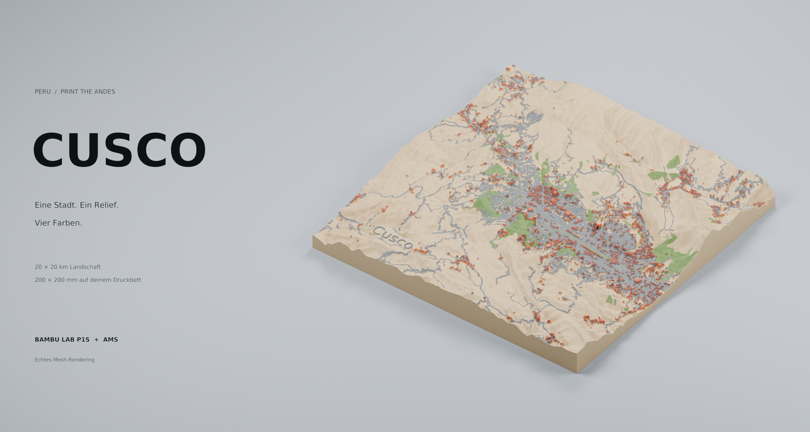
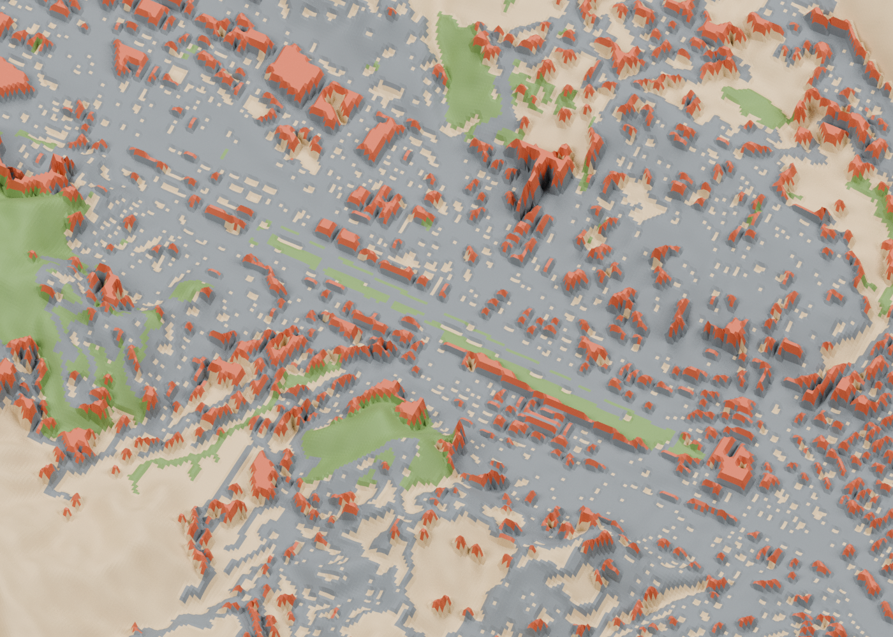
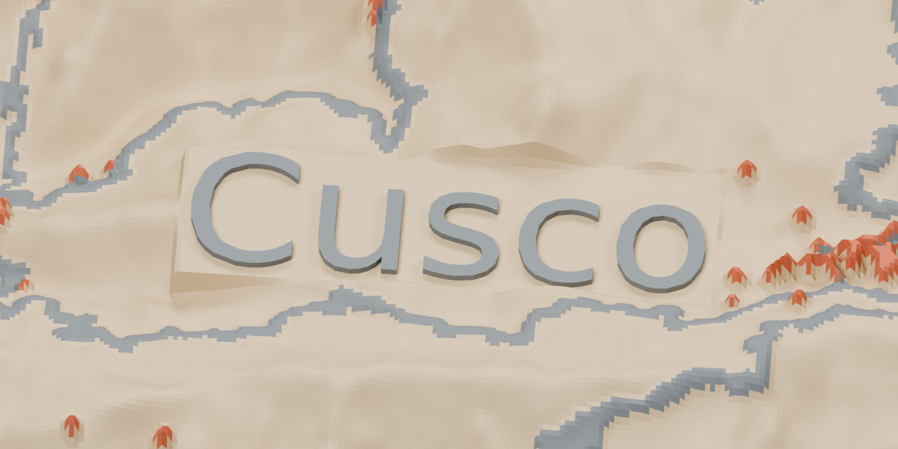

<p align="center">
  
</p>

<h1 align="center">Cusco · Print the Andes</h1>

<p align="center">
  Ein Stück Peru für dein Druckbett.<br>
  Echtes Gelände, kartierte Stadtstrukturen und vier AMS-Farben.
</p>

<p align="center">
  <strong>Bambu Lab P1S</strong> &nbsp;·&nbsp; 4 Farben &nbsp;·&nbsp; 200 × 200 × 24,23 mm
</p>

<p align="center">
  <a href="output/print_v2/Cusco_P1S_AMS.3mf"><strong>3MF herunterladen</strong></a>
  &nbsp; / &nbsp; <a href="output/print_v2/Cusco_Gesamtansicht.png">Modell ansehen</a>
  &nbsp; / &nbsp; <a href="output/print_v2/Druckhinweise.md">Druckhinweise</a>
</p>

---

## Die Anden im kleinen Maßstab

Dieses Relief zeigt **20 × 20 km rund um Cusco**: das Tal, seine Berghänge, Straßen, Häusergruppen und kartierte Grünflächen. SRTM-Höhendaten liefern die Landschaft, OpenStreetMap die Stadtstrukturen.

Ein geschlossener Unterbau mit ebener Unterseite trägt das Modell. **„Cusco“ steht waagerecht auf einer kleinen ebenen Fläche innerhalb des Modells** vorne links. Nur dieser etwa 30 × 9 mm große Bereich ist eingeebnet; die grauen Buchstaben sind 0,48 mm erhaben. Der zusätzliche vordere Beschriftungsstreifen entfällt. Vier getrennte Farbvolumen bilden gemeinsam das zusammenhängende Relief.

> **Digital geprüft, noch nicht physisch probegedruckt.** Geometrieprüfung und vollständiger Probeschnitt in Bambu Studio waren erfolgreich. Die Bilder sind Renderings der tatsächlichen Druckmeshes, keine Fotos eines fertigen Drucks.

## Vom Download auf die Druckplatte

1. **[Cusco_P1S_AMS.3mf herunterladen](output/print_v2/Cusco_P1S_AMS.3mf)** — auf GitHub über „Download raw file“ auf der Dateiseite.
2. In Bambu Studio **als Projekt öffnen**, damit Teile, Profile und Anordnung erhalten bleiben. Enthalten ist das P1S-Profil für die 0,4-mm-Düse.
3. Vier kompatible PLA-Filamente zuordnen und die tatsächlichen AMS-Slots prüfen.
4. Platte neu slicen, Schichtvorschau und Spülturm kontrollieren, dann drucken.

Zum Drucken sind weder Python noch Blender erforderlich. Die 3MF ist ein editierbares Projekt; es wird kein vorgefertigter G-Code an den Drucker gesendet.

### Vier Farben, vier Aufgaben

| Zuordnung im Projekt | Modellteil | Farbton |
| --- | --- | --- |
| 1 | Gelände und Sockel | Sand-/Erdbraun · `#B8A17C` |
| 2 | Straßen, Flughafen und Schrift | Dunkles Steingrau · `#64696C` |
| 3 | Gebäude | Terrakotta · `#AC5438` |
| 4 | Vegetation | Gedämpftes Grün · `#637D46` |

Eine reduzierte, landschaftlich orientierte Palette, keine Satellitenbild-Textur. Filament und Beleuchtung beeinflussen den tatsächlichen Eindruck.

<details>
<summary><strong>Flughafen und Stadtstrukturen im Detail</strong></summary>



Echtes Rendering der Druckmeshes; keine zusätzlichen Farben oder aufgemalten Details.

</details>

### Das mitgelieferte Druckprofil

| Einstellung | Wert |
| --- | --- |
| Drucker / Düse | Bambu Lab P1S / 0,4 mm |
| Material / Schichthöhe | PLA / 0,16 mm |
| Wände / Füllung | 3 / 12 % Gyroid |
| Deck- / Bodenschichten | 5 (mindestens 1 mm) / 4 |
| Innere Optimierungen | Füllschichten kombinieren; in Füllung spülen |
| Stützen | Aus |
| Modellabmessungen | 200 × 200 × 24,23 mm |
| Geschätzte Druckzeit | ca. 23 h 00 min |
| Geschätzter Materialbedarf | ca. 297 g inklusive Spülabfall |

Die Schätzungen stammen aus dem Probeschnitt mit **Bambu Studio 2.8.2.61**: 150 Schichten und 316 Filamentwechsel. Andere Filamente und Einstellungen ändern diese Werte. Die geprüfte Platzierung des Spülturms neben dem Modell ist im Projekt enthalten.

### Was die Zeitoptimierung tatsächlich bringt

| Vollständiger Probeschnitt | Druckzeit | PLA einschließlich Spülabfall |
| --- | --- | --- |
| Ursprüngliches Modell und Profil | 23 h 56 min 47 s | 307 g |
| Verbesserte Stadt und Flughafen, noch mit vorderem Schriftstreifen | 23 h 19 min 13 s | 306 g |
| Aktuell: waagerechte Schrift auf ebener Fläche innerhalb des Modells | **23 h 00 min 13 s** | **297 g** |

Die aktuelle Fassung mit ebener Schriftfläche innerhalb des Modells spart gegenüber der Fassung mit vorderem Schriftstreifen **19 Minuten und 9,2 g PLA**. Gegenüber dem ursprünglichen Projekt sind es insgesamt **56 min 34 s**. Der Landschaftsausschnitt, das Raster der Stadtstrukturen und die Gebäudehöhen bleiben erhalten; nur die kleine freie Schriftfläche wird eingeebnet. Alle sechs Vergleichsergebnisse stehen in [print_time_comparison.json](output/print_v2/print_time_comparison.json).

Die sichtbare Auflösung bleibt bei **0,16 mm**, mit drei Wänden, 12 % Gyroid und unveränderten Oberflächengeschwindigkeiten. Kombinierte Füllschichten betreffen das Innere; beim Spülen in die Füllung ist deckendes PLA erforderlich, damit Mischfarben nicht durchscheinen. Diese Funktionsweise beschreibt auch [Bambu Studio](https://raw.githubusercontent.com/bambulab/BambuStudio/master/src/libslic3r/PrintConfig.cpp).

Die 316 Farbwechsel und rund 7½ Stunden Spülzeit bleiben der große Aufwand. Gröbere Schichten oder weniger Farben wären sichtbare Kompromisse. Ein physischer Probedruck zur Bestätigung von Farbdurchdeckung, Haftung und Oberfläche steht noch aus.

<details>
<summary><strong>Beschriftung aus der Nähe ansehen</strong></summary>



DejaVu Sans, 7,5 mm Schriftbildhöhe in der Draufsicht; 0,48 mm in die ebene Fläche eingebettet und 0,48 mm erhaben. Alle fünf Buchstaben stehen auf derselben waagerechten Ebene. Die rund 30 × 9 mm große Fläche geht über einen schmalen Rand ins Gelände über und hält Abstand zu kartierten Straßen, Gebäuden und Grünflächen. Der bisherige 16-mm-Beschriftungsstreifen entfällt vollständig; der 20 × 20 km große Landschaftsausschnitt bleibt erhalten.

</details>

## Was im Modell steckt

- **Durchgängige Höhen:** Die Kacheln S14W073 und S14W072 haben an der geprüften Naht keine Höhendifferenz; der Ausschnitt enthält keine Datenlücken. Eine leichte Gauß-Glättung mit rund 34 m Standardabweichung beruhigt das Raster.
- **Erkennbare Stadtstrukturen:** 97.252 OSM-Gebäudegrundrisse werden zu druckbaren Häusergruppen zusammengefasst. Der Dachhöhenaufschlag beträgt jetzt 1,20 statt 0,95 mm, der Straßenaufschlag 0,32 statt 0,18 mm. Die Übergänge werden an gemeinsamen Rasterpunkten gemittelt. Straßenbreiten bleiben unverändert; dunklere, gedämpfte Farbtöne unterstützen die Erkennbarkeit.
- **Kartierter Flughafen:** Startbahn 10/28, 18 Rollwegsegmente und zwei Vorfelder ergänzen den Flughafen Velasco Astete. Startbahn und Rollwege sind für die Düse auf rund 1,09 bzw. 0,54 mm verbreitert, mit 0,40 mm Höhenaufschlag. Sie nutzen die Straßenfarbe und benötigen keinen fünften AMS-Slot.
- **Kartiertes Grün:** Grünflächen und Baumstandorte erscheinen als flache, integrierte Reliefbereiche, nicht als freistehende Miniaturbäume.
- **Stabiler Unterbau:** 4 mm Sockelbasis vor der 0,64 mm tiefen Einbettung der farbigen Oberflächen; ebene Unterseite und geschlossene Farbvolumen. Die Einbettung wurde um eine 0,16-mm-Schicht reduziert, ohne die äußere Modellform zu verändern.

**Bewusste Vereinfachungen:** Horizontaler Maßstab 1:100.000, Höhen 1,6-fach überhöht. Gebäudehöhen sind schematisch. Kleine Gassen und Grundstücksgrenzen lassen sich nicht einzeln darstellen. Vegetationsdaten sind unvollständig: Braune Flächen bedeuten nicht automatisch vegetationslosen Boden. Dekoratives Modell, keine Vermessungsgrundlage.

## Geprüft und nachvollziehbar

Der [Prüfbericht](output/print_v2/validation.json) dokumentiert:

- vier geschlossene Farbvolumen mit konsistenter Normalenausrichtung;
- einen zusammenhängenden Körper nach boolescher Vereinigung;
- numerisch vernachlässigbare Überschneidungen der Farbteile;
- 151 nichtleere horizontale Prüfschnitte in 0,16-mm-Abständen;
- fünf zusammenhängende Schriftzeichen auf einer nachweislich ebenen Fläche, mit geprüfter Einbettungsdicke und ohne überdeckte Kartenmerkmale;
- Import ohne Mesh-Reparaturen und erfolgreichen Bambu-Probeschnitt;
- SHA-256-Prüfsummen der Druckdatei und der erzeugten STL-Teile.

Das finale Plattenergebnis enthält keine Warnmeldung. Das ist keine Garantie für einen fehlerfreien physischen Druck; Material, Haftung und Druckereinstellungen müssen vor Ort passen.

## Selbst bauen und rendern

Die fertige 3MF liegt bereits im Repository. Für eigene Läufe wurden **Python 3.12**, die festgehaltenen Abhängigkeiten und **Blender 5.0.1** verwendet. Die Skripte erwarten DejaVu Sans unter `/usr/share/fonts/truetype/dejavu/`.

```bash
python3.12 -m venv .venv-model
.venv-model/bin/python -m pip install -r requirements-print.txt

# Gelände, Farbteile, neutrale 3MF und Geometrieprüfung
MPLCONFIGDIR=/tmp/cusco-mpl .venv-model/bin/python build_print_model.py

# STL-Renderings und anschließend die README-Hero-Grafik
blender -b --factory-startup -t 8 --python render_print_model.py
blender -b --factory-startup -t 8 --python render_airport_detail.py
blender -b --factory-startup -t 8 --python render_hero.py
```

Diese Befehle erzeugen Geometrie und Bilder, **nicht automatisch das native P1S-Projekt**. `prepare_bambu_check.py` und `finalize_print_package.py` gehören zum lokalen Bambu-Prüfworkflow. Ersteres erwartet extrahierte offizielle Bambu-Profile unter `/tmp/squashfs-root/resources/profiles/BBL`; Letzteres benötigt den nativen Export und einen erfolgreichen vollständigen Probeschnitt unter `output/print_v2/check/`.

Mit der lokal entpackten Bambu-Studio-Version und ihren Laufzeitbibliotheken:

```bash
.venv-model/bin/python prepare_bambu_check.py
LD_LIBRARY_PATH=/tmp/squashfs-root/bin:/tmp/cusco-render-libs/usr/lib/x86_64-linux-gnu \
LC_ALL=C /tmp/squashfs-root/bin/bambu-studio \
  --datadir /tmp/cusco-bambu-v2-refined-config --arrange 0 --orient 0 \
  --load-settings 'output/print_v2/check/machine.json;output/print_v2/check/process.json' \
  --load-filaments 'output/print_v2/check/filament1.json;output/print_v2/check/filament2.json;output/print_v2/check/filament3.json;output/print_v2/check/filament4.json' \
  --slice 1 --export-3mf Cusco_unsliced.3mf --outputdir output/print_v2/check \
  output/print_v2/Cusco_AMS_4_Farben.3mf
# Erst nach erfolgreichem Schnitt und den neuen Renderings:
.venv-model/bin/python finalize_print_package.py
```

Der Zwischenexport heißt aus Kompatibilitätsgründen `Cusco_unsliced.3mf`;
beim obigen kombinierten Schnitt/Export enthält er auch G-Code, den die
Paketierung aus der ausgelieferten, editierbaren 3MF entfernt.

Ein erneuter Modellbau ersetzt den Prüfbericht zunächst durch die reine Geometrieprüfung; anschließend muss auch der Probeschnitt erneuert werden.

### Orientierung im Repository

| Datei / Verzeichnis | Inhalt |
| --- | --- |
| [`hero.png`](hero.png) | Hero-Rendering aus der tatsächlichen STL-Szene |
| [`output/print_v2/Cusco_P1S_AMS.3mf`](output/print_v2/Cusco_P1S_AMS.3mf) | Empfohlenes Druckprojekt mit vier Farbzuordnungen |
| [`output/print_v2/Druckhinweise.md`](output/print_v2/Druckhinweise.md) | Eigenständige Druckhinweise |
| [`data/`](data/) | Lokale Höhen- und OSM-Quelldaten |
| [`build_print_model.py`](build_print_model.py) | Modellgenerator und Mesh-Prüfungen |
| [`render_print_model.py`](render_print_model.py) | Gesamtansicht und Beschriftungsdetail mit Cycles/CPU |
| [`render_hero.py`](render_hero.py) | Breites Hero-Layout aus der gespeicherten Blender-Szene |
| [`requirements-print.txt`](requirements-print.txt) | Python-Abhängigkeiten |

Aktuell ist ausschließlich die Modellfassung unter **`output/print_v2/`**. Andere Generator- und Vorschau-Skripte stammen aus früheren Entwicklungsständen. Alte Exporte, generierte STL-Dateien, alternative 3MFs, Blender-Szenen und temporäre Slicer-Dateien bleiben lokal und werden von Git ignoriert. Die aktuelle P1S-3MF, Hero-Grafik, Modell-PNGs, Druckhinweise und der Prüfbericht sind versioniert.

## Daten & Credits

- **Gelände:** [AWS Terrain Tiles / Mapzen](https://registry.opendata.aws/terrain-tiles/), SRTM-basierte Skadi-HGT-Kacheln mit etwa 30 m Quellraster; Abruf September 2026.
- **Stadt und Vegetation:** © [OpenStreetMap-Mitwirkende](https://www.openstreetmap.org/copyright), [ODbL](https://opendatacommons.org/licenses/odbl/1-0/); Overpass-Abfragen vom 13. September 2026. Wege und einzelne Baumknoten sind enthalten; komplexe Multipolygon-Relationen wurden nicht zusätzlich abgefragt.
- **Flughafen:** Ergänzende Overpass-Abfrage vom 24. September 2026, Server-Datenstand **15. Juli 2026**. Geometrien, Quellzeitstempel und Abfrage sind in `data/cusco_airport.json` gespeichert; gleiche OSM-Lizenz.
- **Schrift:** DejaVu Sans.

Ein unabhängiges Modellprojekt, nicht von Bambu Lab herausgegeben.
