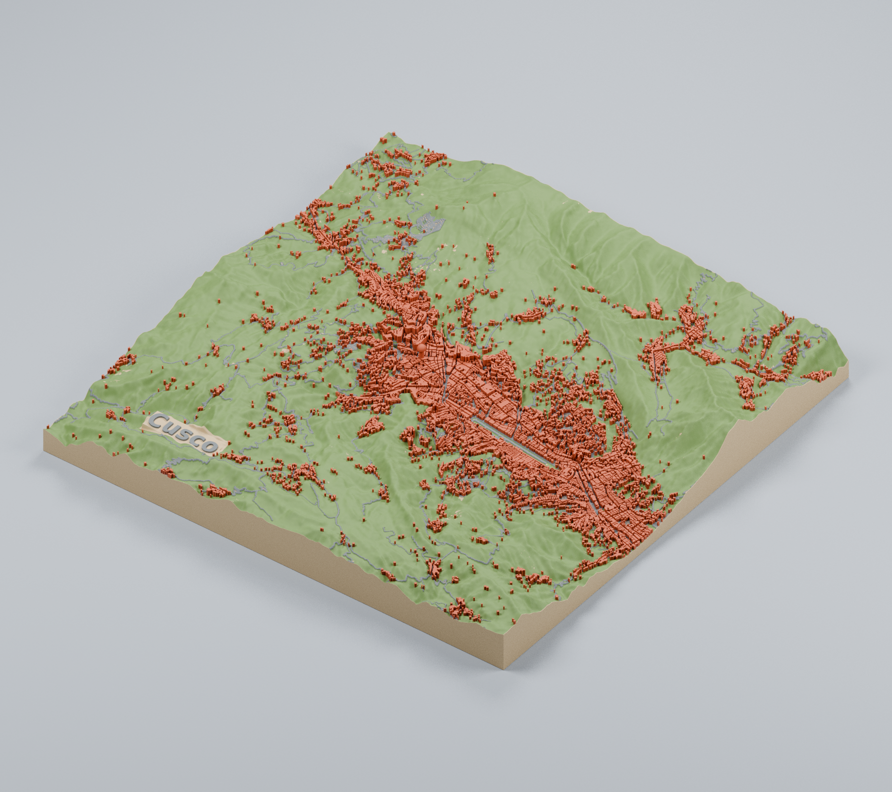
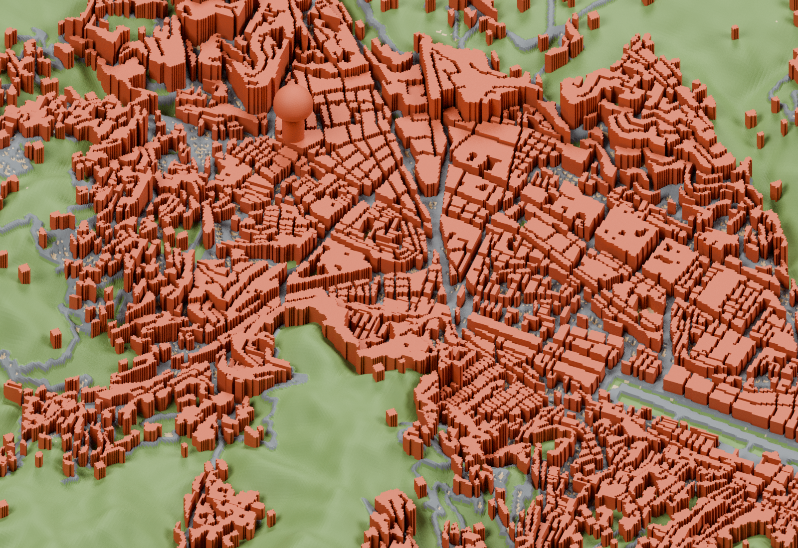

# Cusco · Print the Andes



20 × 20 km rund um Cusco als vierfarbiges Relief für den Bambu Lab P1S.
**200,00 × 200,00 × 23,81 mm**, horizontal 1:100.000, Höhen 1,6-fach überhöht.

[Geprüftes P1S-Projekt](output/print_v2/Cusco_P1S_AMS.3mf) ·
[Testdruck, 40 × 40 mm](output/print_v2/Cusco_Testdruck_P1S.3mf) ·
[Druckhinweise](output/print_v2/Druckhinweise.md)

## Überarbeitete Darstellung

- Häusergruppen haben waagerechte Dächer und senkrechte Wände. Der Höhenaufschlag beträgt **0,48 / 0,64 / 0,80 mm**, abgestuft nach Grundfläche unter 1 / unter 4 / ab 4 mm². Diese Abstufung ist schematisch, keine gemessene Gebäudehöhe.
- Wald, Buschland und Gras bleiben grün; WorldCover-Ackerland erhält die Erdfarbe. Ein rund 0,95-mm-Mehrheitsfilter beruhigt die Vegetationsgrenzen. OSM-Grünflächen bleiben berücksichtigt. Grün belegt aktuell rund **70.9 %** der Rasterfläche; Vegetation erhöht das Gelände nicht.
- Hauptstraßen unterscheiden sich durch etwa 0,55–0,82 mm Rasterbreite von Nebenstraßen. Der Straßenaufschlag beträgt 0,24 mm. Dichte Viertel behalten einen etwa 0,27-mm-Nebenstraßenkern. Die 0,4-mm-Düse kann diese Details vereinfachen.
- Flughafen mit Startbahn, 18 Rollwegsegmenten und zwei Vorfeldern; 0,40 mm Aufschlag.
- Eine kleine **38 × 18 mm große Infotafel oben im Gelände** zeigt **Cusco**, **Scale 1:100 000**, **3200–4430 m** und **above sea level**. Ihre Position nahe einer Ecke wird automatisch ohne Straßen oder Gebäude im reservierten Bereich gewählt. Die Schrift liegt 0,64 mm über einer braunen, waagerechten Fläche.
- Der Nordpfeil mit **N** gehört zur Infotafel. Norden entspricht +Y. Die mit **1 km** beschriftete 10-mm-Maßstabsleiste auf der Tafel entspricht einem Kilometer. Die gerundete Höhenangabe beschreibt Meter über dem Meeresspiegel.
- Alle Standort-Pins und Landmarkenringe sind entfernt. Die Seitenkanten tragen keine Beschriftung.


### Stadt und Flughafen

| Stadtzentrum | Flughafen |
| --- | --- |
|  |  |

Alle gezeigten Ansichten stammen aus den Druckmeshes der aktuellen Fassung, einschließlich der mit **1 km** beschrifteten Infotafel.

## Druck und Prüfung

Vier kompatible, deckende PLA-Filamente zuordnen und die 3MF **als Projekt** öffnen.
0,4-mm-Düse, 0,16-mm-Schichten, drei Wände, 12 % Gyroid, fünf Deck- und vier Bodenschichten.
Automatische Baumstützerkennung, Spülen in die Füllung und kombinierte Füllschichten bleiben aktiviert.

| AMS | Teile | Farbe |
| --- | --- | --- |
| 1 | Gelände und Sockel | Erdbraun #B8A17C |
| 2 | Straßen, Flughafen und Infotafel | Steingrau #64696C |
| 3 | Gebäude | Terrakotta #AC5438 |
| 4 | Vegetation | Grün #637D46 |

Der neue vollständige Probeschnitt mit Bambu Studio 2.8.2.61 schätzt **28 h 10 min 31 s**, **315.54 g PLA**, **355 Farbwechsel**.
Diese Werte gehören zur überarbeiteten Geometrie. Eigene Filamente und Profile können sie verändern.
Das Projekt enthält keinen vorgefertigten G-Code.

Vier geschlossene Farbvolumen, konsistente Normalen, paarweise Schnittvolumen,
ein zusammenhängender Gesamtkörper und alle horizontalen Schichten wurden geprüft.
Die einfarbige Alternative wird mit 0,001 mm Toleranz vereinfacht und nach STL-Rückimport erneut geprüft.
Der Prüfbericht steht in [validation.json](output/print_v2/validation.json).

**Noch kein physischer Probedruck.** Zuerst den separaten 40 × 40-mm-Ausschnitt drucken.
Er zeigt dichte Bebauung, Hang, schmale Straßen im unveränderten Maßstab.
Farbtrennung, Straßenkontinuität, Gebäudehaftung prüfen.
Die Infotafel ist außerhalb dieses Stadtausschnitts; sie zusätzlich in der Schichtvorschau kontrollieren.

## Daten und Reproduktion

SRTM-Höhen, OpenStreetMap, 81.444 ergänzende Microsoft-Grundrisse und ESA WorldCover 2021.
Die ursprüngliche Geländegrundlage und Glättung bleiben erhalten.
Automatisch erkannte Grundrisse können Fehler enthalten; Gruppen entsprechen keinen gezählten Einzelhäusern.
Dekoratives Modell, keine Vermessungsgrundlage.
Historische Abdeckungs-, Dichte- und Druckzeitvergleiche beschreiben frühere Fassungen.

```bash
MPLCONFIGDIR=/tmp/cusco-mpl .venv-model/bin/python -m unittest test_map_raster.py
MPLCONFIGDIR=/tmp/cusco-mpl .venv-model/bin/python build_print_model.py
.venv-model/bin/python check_print_overhangs.py
.venv-model/bin/python prepare_test_coupon.py
blender -b --factory-startup -t 8 --python render_print_model.py
.venv-model/bin/python prepare_bambu_check.py
```

Danach mit den erzeugten Profilen frisch slicen und erst bei erfolgreichem Ergebnis
`finalize_print_package.py --check-dir output/print_v2/check_scale_label` ausführen.
Python-Abhängigkeiten: requirements-print.txt; Renderings verwenden Blender.
Die lokale Slicer-Anwendung liegt unter /tmp/squashfs-root, ergänzende Bibliotheken unter /tmp/cusco-render-libs.

## Daten und Credits

- Gelände: [AWS Terrain Tiles / Mapzen](https://registry.opendata.aws/terrain-tiles/), SRTM-basierte Skadi-HGT-Kacheln S14W073 und S14W072; Abruf September 2026.
- Straßen, Gebäude und kartierte Vegetation: © [OpenStreetMap-Mitwirkende](https://www.openstreetmap.org/copyright), [ODbL](https://opendatacommons.org/licenses/odbl/1-0/). Overpass-Daten vom 13. September 2026; Flughafenabfrage vom 24. September, Server-Datenstand 15. Juli 2026.
- Zusätzliche Grundrisse: [Microsoft Global ML Building Footprints](https://github.com/microsoft/GlobalMLBuildingFootprints/), Stand 13. August 2026, [CDLA Permissive 2.0](https://cdla.dev/permissive-2-0/). Cusco-Kachel `210031023`; Download-URL, Filter und Prüfsummen in `data/cusco_buildings_ms.json`; vollständiger Lizenztext in `data/CDLA-Permissive-2.0.txt`.
- Landbedeckung: [ESA WorldCover 2021 v200, Zanaga et al.](https://doi.org/10.5281/zenodo.7254221), [CC BY 4.0](https://creativecommons.org/licenses/by/4.0/). © ESA WorldCover project 2021 / Contains modified Copernicus Sentinel data (2021) processed by ESA WorldCover consortium. Kacheln S15W075 und S15W072; Quellen und Prüfsummen in `data/cusco_worldcover_2021.json`.
- Schrift: DejaVu Sans Bold.

Ein unabhängiges Modellprojekt, nicht von Bambu Lab herausgegeben.
