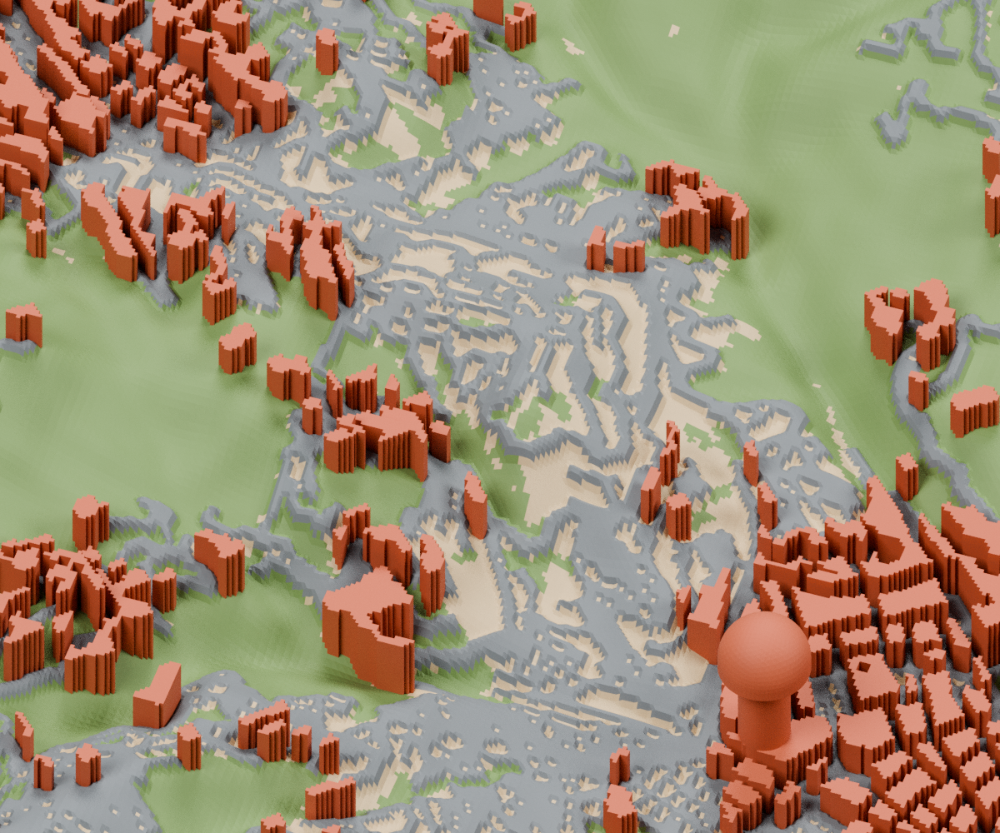
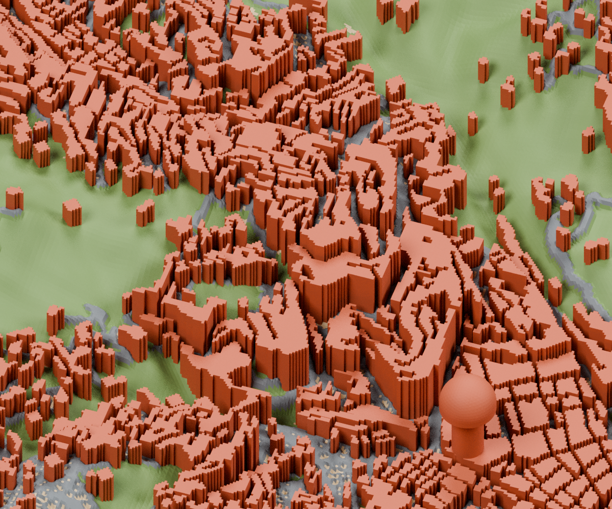
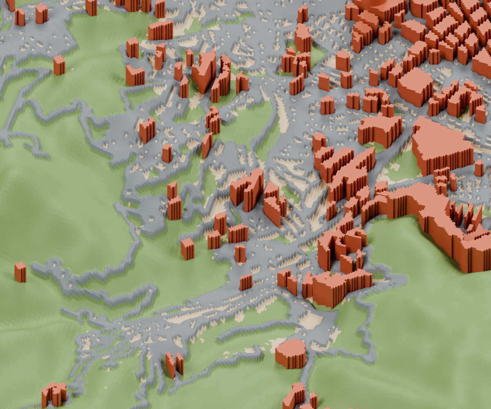
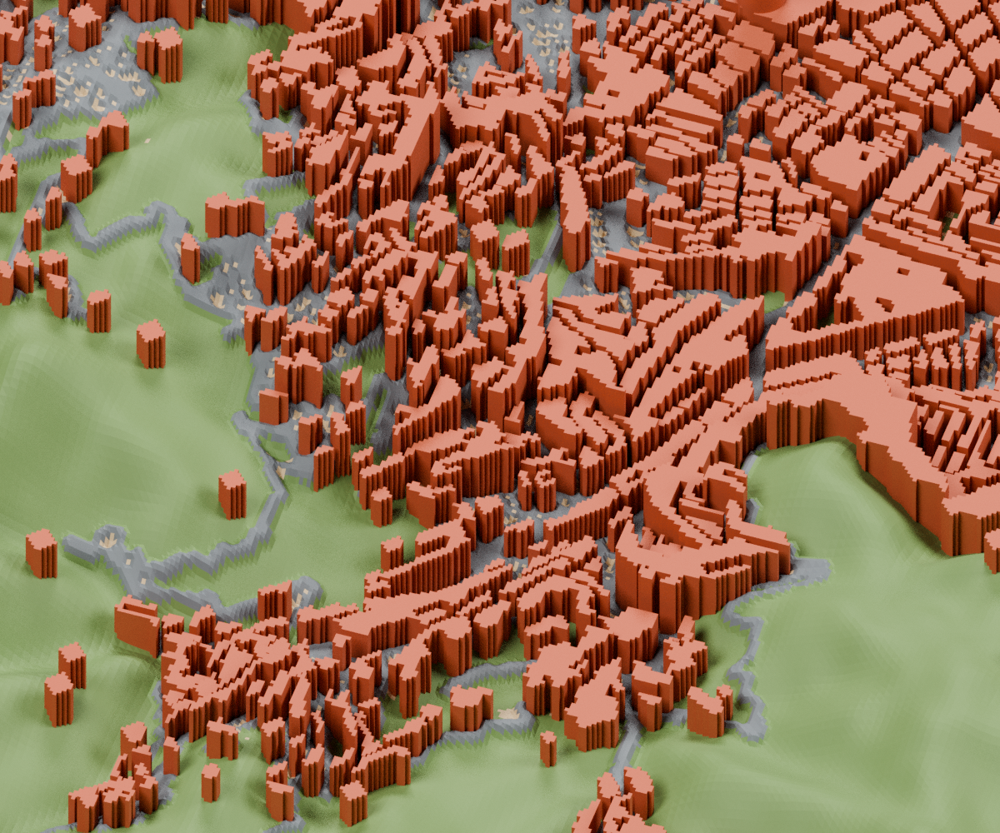
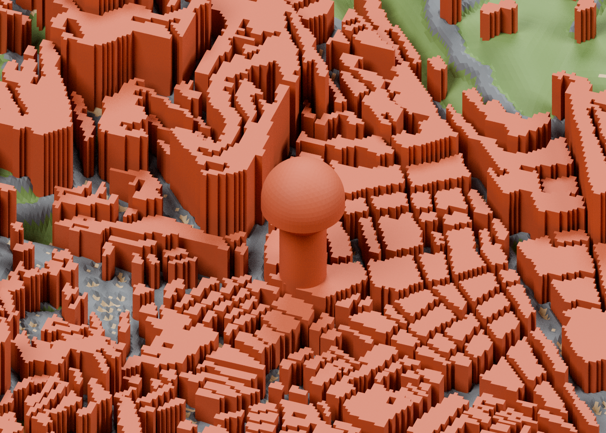

<p align="center"></p>

<h1 align="center">Cusco · Print the Andes</h1>

<p align="center">Ein Stück Peru für dein Druckbett.<br>Echtes Gelände, ergänzte Gebäudegrundrisse und vier AMS-Farben.</p>

<p align="center"><strong>Bambu Lab P1S · 200 × 200 × 24,53 mm</strong></p>

<p align="center"><a href="output/print_v2/Cusco_P1S_AMS.3mf"><strong>3MF herunterladen</strong></a> / <a href="output/print_v2/Cusco_Gesamtansicht.png">Modell ansehen</a> / <a href="output/print_v2/Druckhinweise.md">Druckhinweise</a></p>

## Die Stadt ist vollständiger

Das Relief zeigt **20 × 20 km rund um Cusco**. SRTM-Höhen bilden die Landschaft,
OpenStreetMap liefert Straßen, Gebäude und kartierte Grünflächen. Microsoft
Global ML Building Footprints ergänzt zuvor unzureichend erfasste Viertel.
ESA WorldCover 2021 ergänzt die Vegetationsfarbe und hilft, Abdeckungslücken zu erkennen.

Die letzte Vorschau zeigte einige Viertel fast nur als Straßennetz. Dort fehlten
Gebäude bereits in der OSM-Datei; zusätzlich verdrängten überzeichnete Straßen
zu viel Bebauung. Die neue Fassung ergänzt **81.444 Grundrisse** nach dem
OSM-Abgleich und gibt Häusern die Randbereiche kleiner Nebenstraßen zurück.
Hauptstraßen und Flughafen bleiben geschützt. Ein schmaler Kern der Nebenstraßen
erhält die Blockstruktur; die Rasterbreite beträgt in Engstellen etwa 0,27 mm.

| Vergleich der Druckgeometrie | Ursprünglich mit Pin | Letzte Vorschau | Jetzt |
| --- | --- | --- | --- |
| Gebäudefläche in der Draufsicht | 1.764 mm² | 2.344 mm² | **3.642 mm²** |
| Getrennte Häusergruppen | 1.479 | 2.776 | **4.938** |
| Gebäudefläche im zentralen 5 × 5-km-Ausschnitt | 252 mm² | 360 mm² | **864 mm²** |

Die Flächen beziehen sich auf generalisierte Modellgeometrie. Häusergruppen und
ergänzte Quellpolygone sind keine Zählung einzelner realer Häuser. Gegenüber der
letzten Vorschau ist die Gebäudefläche um **55 %** gewachsen. Die Quelle, Filter
und Prüfsummen stehen in [cusco_buildings_ms.json](data/cusco_buildings_ms.json),
die Messungen in [city_density_comparison.json](output/print_v2/city_density_comparison.json).

### Die zuvor leeren Viertel

| Nordwesten – vorher | Nordwesten – jetzt |
| --- | --- |
|  |  |

| Südwesten – vorher | Südwesten – jetzt |
| --- | --- |
|  |  |

Die Bilder zeigen die tatsächlichen Druckmeshes bei gleicher Kamera und Beleuchtung.
Im gesamten Ausschnitt sinkt der Anteil als bebaut klassifizierter Fläche ohne
Gebäudegrundriss in 100 Metern Entfernung von **14,6 % auf 2,9 %**. Im untersuchten
Nordwest-Viertel sinkt er von 69,7 % auf 0 %, im Südwest-Viertel von 35,6 % auf
unter 0,01 %. Dies ist ein Abdeckungsindikator, kein Nachweis, dass jedes reale
Haus enthalten ist. Der [Abdeckungsbericht](output/print_v2/building_coverage_comparison.json)
und die [Flughafen-Vergleichsansicht](output/print_v2/Cusco_Flughafenumfeld_Jetzt.png)
ergänzen die Prüfung.

## Landschaft, Schrift und Pin

Die ursprünglichen Geländedreiecke bleiben erhalten und werden für Kartenmerkmale
auf rund **14 m Rasterweite** unterteilt. Die Höhen sind 1,6-fach überhöht, die
SRTM-Daten mit rund 34 m Standardabweichung geglättet. Die geprüfte Kachelnaht
hat keine Höhendifferenz, der Ausschnitt keine Datenlücken.

Häusergruppen erhalten waagerechte Dächer und senkrechte Wände. Der schematische
Dachaufschlag beträgt 1,20 mm über dem höchsten Oberflächenpunkt des jeweiligen
Blocks. Vegetation erhöht das Gelände nicht. Straßen sind 0,32 mm erhaben;
Startbahn, 18 Rollwegsegmente und zwei Vorfelder sind mit 0,40 mm Aufschlag enthalten.

**„Cusco“** steht waagerecht auf einer etwa 30 × 9 mm großen internen Fläche
vorne links: DejaVu Sans Bold, 28,8 × 7,5 mm Schriftbild, 0,64 mm erhaben und
0,48 mm eingebettet. Ein neues Gebäuderasterfeld wird für diese dekorative Fläche
ausgespart und im Prüfbericht ausgewiesen. Der alte vordere Beschriftungsstreifen entfällt.

Der Terrakotta-Pin markiert **−13.521908269187426, −71.98500062613564**. Seine Achse
liegt bei X = 81,016 / Y = 111,178 mm ab der südwestlichen Modellecke. Er steht
5 mm über der höchsten unmittelbaren Umgebung; Schaft 1,8 mm, Kopf 3,2 mm breit,
mit abgerundetem Abschluss und 45°-Schulter. Er ist fest in das Relief eingebettet.



## Drucken

1. [Cusco_P1S_AMS.3mf](output/print_v2/Cusco_P1S_AMS.3mf) herunterladen und in Bambu Studio **als Projekt** öffnen.
2. Vier kompatible, deckende PLA-Filamente und die tatsächlichen AMS-Slots zuordnen.
3. Neu slicen, Schichtvorschau und Spülturm prüfen, dann drucken.

| Zuordnung | Modellteile | Farbton |
| --- | --- | --- |
| 1 | Gelände und Sockel | Sand-/Erdbraun `#B8A17C` |
| 2 | Straßen, Flughafen, Schrift | Steingrau `#64696C` |
| 3 | Gebäude und Pin | Terrakotta `#AC5438` |
| 4 | Vegetation | Grün `#637D46` |

Rund 75 % der Draufsicht sind grün. WorldCover 2021 v200 und OSM liefern die
Flächen; alle Vegetationstypen teilen sich einen Grünton. Braun umfasst Sockel,
Schriftfläche und übrige Flächen einschließlich Wasser. Die Farben sind keine
Satellitenbild-Textur oder jahreszeitliche Aufnahme.

Das Projekt enthält das P1S-Profil für die 0,4-mm-Düse: **0,16-mm-Schichten,
drei Wände, 12 % Gyroid**, fünf Deck- und vier Bodenschichten, mindestens 1 mm
Deckschale. Automatische Baumstützen sind aktiviert; im geprüften Probeschnitt
entstehen keine Stützbahnen. Füllschichten kombinieren und Spülen in die Füllung
sind aktiv. Innere Füllbahnbreite 0,45 mm. Der seitliche Spülturm ist geprüft angeordnet.

Der aktuelle vollständige Probeschnitt mit **Bambu Studio 2.8.2.61** ergibt
**29 h 14 min 43 s**, **317,62 g PLA**, 153 Schichten und 353 Filamentwechsel. Die 3MF ist ein editierbares Projekt ohne vorgefertigten G-Code.
Andere Filamente und Einstellungen verändern diese Schätzungen.

| Vollständiger Probeschnitt | Geschätzte Zeit | PLA inklusive Spülabfall |
| --- | --- | --- |
| Ursprüngliches Modell und Profil | 23 h 56 min 47 s | 307 g |
| WorldCover und ergänzte Straßenverbindungen | 25 h 12 min 02 s | 308 g |
| Zusätzlich Standort-Pin | 25 h 13 min 51 s | 308 g |
| **Ergänzte Gebäude und angepasste Straßenpriorität** | **29 h 14 min 43 s** | **318 g** |

Die bisherigen Messungen und nicht übernommenen Optimierungsversuche bleiben in
[print_time_comparison.json](output/print_v2/print_time_comparison.json) erhalten.
Die Zwischenvorschau mit dichterer OSM-Bebauung war kein fertig gemessener Druckbenchmark.

> **Digital geprüft, noch nicht physisch probegedruckt.** Die Geometrieprüfung und
> der vollständige Probeschnitt sind erfolgreich. Die vier Farbteile wurden ohne
> Mesh-Reparaturen importiert; das Plattenergebnis enthält keine Warnmeldung.
> Sehr schmale Farbdetails können beim Slicen vereinfacht werden. Haftung,
> Farbdurchdeckung und die feinen Stadtstrukturen sind physisch noch zu bestätigen.

Ohne automatische Stützerkennung meldet Bambu mögliche schwebende Bereiche.
Die vollständige automatische Stützberechnung erzeugt keine Stützbahnen;
die zusätzliche Prüfung der STL-Schichten bestätigt die Abstützung zur jeweils
vorigen Schicht. Deshalb bleibt die automatische Erkennung im Profil aktiv.
Die Meldung wird dokumentiert und die Warnprüfung bei der Paketierung beibehalten.

Die automatisch erkannten Zusatzgrundrisse können Fehler und Auslassungen enthalten.
Für die übernommenen Zusatzgrundrisse ist die Konfidenz unbekannt; sie werden
nicht als gesichert vermessen behandelt. Kleine Einzelhäuser können bei
1:100.000 nicht maßstäblich gedruckt werden. Dekoratives Modell, keine Vermessungsgrundlage.

## Prüfung und Reproduktion

Der [Prüfbericht](output/print_v2/validation.json) enthält Quellen und Prüfsummen,
Straßenprioritäten, waagerechte Dächer, Schriftfläche, Pin, vier geschlossene
Farbvolumen mit konsistenter Normalenausrichtung, paarweise Schnittvolumen,
einen zusammenhängenden Gesamtkörper und 153
nichtleere horizontale Prüfschnitte in 0,16-mm-Abständen. Eine zusätzliche Prüfung der tatsächlichen STL-Schichten kontrolliert die Abstützung zur jeweils vorigen Schicht, einschließlich der 45°-Pinschulter. Rundungsreste der Booleschen Vereinigung sind mit Volumengrenze und Gesamtvolumen dokumentiert. Das Bambu-Ergebnis und
Prüfsummen der fertigen Druckdateien gehören zur paketierten Fassung.

Python 3.12, die Versionen in `requirements-print.txt`, Blender 5.0.1 und
DejaVu Sans unter `/usr/share/fonts/truetype/dejavu/` wurden verwendet.

```bash
python3.12 -m venv .venv-model
.venv-model/bin/python -m pip install -r requirements-print.txt
# Optional: Quelldatenausschnitte reproduzieren
MPLCONFIGDIR=/tmp/cusco-mpl .venv-model/bin/python prepare_buildings.py
.venv-model/bin/python prepare_landcover.py
# Tests, Modell und Geometrieprüfung
MPLCONFIGDIR=/tmp/cusco-mpl .venv-model/bin/python -m unittest test_map_raster.py
MPLCONFIGDIR=/tmp/cusco-mpl .venv-model/bin/python build_print_model.py
MPLCONFIGDIR=/tmp/cusco-mpl .venv-model/bin/python check_print_overhangs.py
MPLCONFIGDIR=/tmp/cusco-mpl .venv-model/bin/python analyze_building_coverage.py
# Echte STL-Renderings
blender -b --factory-startup -t 8 --python render_print_model.py
blender -b --factory-startup -t 8 --python render_building_coverage.py
blender -b --factory-startup -t 8 --python render_city_comparison.py
blender -b --factory-startup -t 8 --python render_airport_detail.py
blender -b --factory-startup -t 8 --python render_hero.py
```

Nach dem STL-Export startet die Geometrieprüfung automatisch in einem frischen
Prozess. Der gespeicherte Zwischenstand ist über Quellcode- und STL-Prüfsummen
abgesichert. Ein erfolgreicher Modellbau ersetzt den Prüfbericht zunächst durch
die Geometrieprüfung; für die finale P1S-Datei muss der Probeschnitt erneuert werden.
Historische Vergleichsszenen bleiben lokal; fehlen sie, verwenden die
Vergleichsskripte die versionierten Vorher-Bilder.

Der lokale Bambu-Workflow erwartet die entpackte Anwendung unter `/tmp/squashfs-root`
und benötigte Bibliotheken unter `/tmp/cusco-render-libs`:

```bash
.venv-model/bin/python prepare_bambu_check.py
LD_LIBRARY_PATH=/tmp/squashfs-root/bin:/tmp/cusco-render-libs/usr/lib/x86_64-linux-gnu \
LC_ALL=C /tmp/squashfs-root/bin/bambu-studio \
  --datadir /tmp/cusco-bambu-complete-city --arrange 0 --orient 0 \
  --load-settings 'output/print_v2/check/machine.json;output/print_v2/check/process.json' \
  --load-filaments 'output/print_v2/check/filament1.json;output/print_v2/check/filament2.json;output/print_v2/check/filament3.json;output/print_v2/check/filament4.json' \
  --slice 1 --export-3mf Cusco_unsliced.3mf --outputdir output/print_v2/check_complete_city \
  output/print_v2/Cusco_AMS_4_Farben.3mf
# Erst nach erfolgreichem Probeschnitt und aktuellen Renderings:
.venv-model/bin/python finalize_print_package.py --check-dir output/print_v2/check_complete_city
```

Der Zwischenexport enthält beim kombinierten Schnitt/Export auch G-Code, den die
Paketierung entfernt. Generierte STL, Blender-Szenen und Slicer-Dateien bleiben
lokal. Versioniert sind das P1S-Projekt, Vorschauen, Quelldatenausschnitte,
Druckhinweise und Prüfberichte. Alte Dateien direkt unter `output/` sind Prototypen.

## Daten und Credits

- Gelände: [AWS Terrain Tiles / Mapzen](https://registry.opendata.aws/terrain-tiles/), SRTM-basierte Skadi-HGT-Kacheln S14W073 und S14W072; Abruf September 2026.
- Straßen, Gebäude und kartierte Vegetation: © [OpenStreetMap-Mitwirkende](https://www.openstreetmap.org/copyright), [ODbL](https://opendatacommons.org/licenses/odbl/1-0/). Overpass-Daten vom 13. September 2026; Flughafenabfrage vom 24. September, Server-Datenstand 15. Juli 2026.
- Zusätzliche Grundrisse: [Microsoft Global ML Building Footprints](https://github.com/microsoft/GlobalMLBuildingFootprints/), Stand 13. August 2026, [CDLA Permissive 2.0](https://cdla.dev/permissive-2-0/). Cusco-Kachel `210031023`; Download-URL, Filter und Prüfsummen in `data/cusco_buildings_ms.json`; vollständiger Lizenztext in `data/CDLA-Permissive-2.0.txt`.
- Landbedeckung: [ESA WorldCover 2021 v200, Zanaga et al.](https://doi.org/10.5281/zenodo.7254221), [CC BY 4.0](https://creativecommons.org/licenses/by/4.0/). © ESA WorldCover project 2021 / Contains modified Copernicus Sentinel data (2021) processed by ESA WorldCover consortium. Kacheln S15W075 und S15W072; Quellen und Prüfsummen in `data/cusco_worldcover_2021.json`.
- Schrift: DejaVu Sans Bold.

Ein unabhängiges Modellprojekt, nicht von Bambu Lab herausgegeben.
